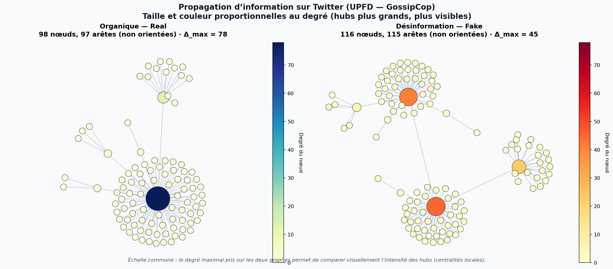

# Détection Algorithmique de Désinformation par les Graphes (XAI)

[](https://fakenewsgraphxai-efszqkiiftvbbvoylzvzgw.streamlit.app)

Ce projet propose une approche pour contrer la désinformation sur les réseaux sociaux. Face à l’essor des IA génératives qui rendent l’analyse textuelle (NLP) fragile et facile à tromper, ce modèle se concentre exclusivement sur la **topologie de diffusion** (la forme géométrique du réseau) pour différencier une propagation organique d’une attaque coordonnée par des bots (astroturfing).



*Figure produite par `visualize.py` : nœuds dimensionnés et colorés selon le degré (hubs visibles).*

---

## Objectif

- Explorer comment la **géométrie du graphe** (et, dans le GNN, des descripteurs nodaux type BERT) permet de distinguer une diffusion organique d’une dynamique coordonnée.


---

## Structure du dépôt

| Fichier | Rôle |
|--------|------|
| `data_loader.py` | Chargement du jeu UPFD (PyG) : sous-corpus `gossipcop`, features `bert`, statistiques descriptives. |
| `feature_engineering.py` | Conversion PyG → NetworkX, métriques topologiques globales, export pandas (sous-échantillon stratifié). |
| `baseline_model.py` | Random Forest (scikit-learn) sur les seules features topologiques ; train/test 80/20 ; accuracy, F1, matrice de confusion. |
| `gnn_model.py` | GCN + pooling + tête racine (logique proche de l’exemple UPFD PyG) ; `CrossEntropyLoss`, Adam ; métriques sur le test. |
| `visualize.py` | Figure Real vs Fake : graphes NetworkX, taille et couleur proportionnelles au degré → `comparaison_graphes.png`. |
| `app.py` | Streamlit : vitrine XAI avec graphes simulés*(mock) pour illustrer hubs et formes de réseau. |
| `test_env.py` | Vérification rapide des versions (PyTorch, PyG, NetworkX). |
| `requirements.txt` | Dépendances Python principales. |

Les données brutes et traitées UPFD sont stockées sous `data/UPFD/` après le premier lancement (à exclure du dépôt Git si elles sont lourdes : voir plus bas).

---

## Stack technique

- **Données** : `pandas`, `numpy`
- **Graphes (CPU)** : `networkx`
- **Deep Learning sur graphes** : `torch`, `torch_geometric`
- **Machine learning classique** : `scikit-learn`
- **Visualisation** : `matplotlib`, `seaborn`
- **Interface** : `streamlit`

UPFD utilise aussi **SciPy** (matrices creuses) lors du prétraitement PyG.

---

## Installation

### Prérequis

- Python **3.10+** recommandé.
- Espace disque: prévoir **~1,5 Go** pour le téléchargement / décompression **GossipCop + BERT**.

### Environnement virtuel

```bash
python -m venv env
source env/bin/activate   # Linux / macOS
pip install -r requirements.txt
```

---

## Utilisation du pipeline (ligne de commande)

À lancer depuis la racine du dépôt (venv activé).

1. **Ingestion UPFD**  
   ```bash
   python data_loader.py
   ```

2. **Features topologiques**  
   ```bash
   python feature_engineering.py --n-samples 800 --seed 42
   # Optionnel : --output data/topology_features.csv
   ```

3. **Baseline (forêt aléatoire)**  
   ```bash
   python baseline_model.py --n-samples 5464 --seed 42
   # Ou : python baseline_model.py --csv data/topology_features.csv
   ```

4. **GCN**  
   ```bash
   python gnn_model.py --epochs 40 --batch-size 32
   ```

5. **Visualisation**  
   ```bash
   python visualize.py
   ```  
   Régénère `comparaison_graphes.png` à la racine.

### Téléchargement UPFD (Google Drive)

Certaines versions de `torch_geometric` pointent vers d’anciens liens Drive (erreur 404). `data_loader.py` met à jour les identifiants avant téléchargement. En repli : placer les fichiers bruts sous `data/UPFD/gossipcop/raw/` (voir [GNN-FakeNews](https://github.com/safe-graph/GNN-FakeNews)).

---

## Application web (Streamlit)

La page ne réentraîne pas le modèle et n’utilise pas UPFD : graphes générés, scores fictifs,etc. Utile pour montrer l’idée des hubs et des formes de diffusion.

```bash
streamlit run app.py
```

---

## Jeu de données UPFD

- **UPFD** (User Preference-aware Fake News Detection) : graphes de propagation sur Twitter. Sous-corpus **GossipCop**, features **BERT** nodales via `torch_geometric.datasets.UPFD`.
- Article de présentation du jeu : [arXiv:2104.12259](https://arxiv.org/abs/2104.12259) — dépôt associé : [GNN-FakeNews](https://github.com/safe-graph/GNN-FakeNews).

Les graphes sont souvent des arbres : le clustering moyen peut être nul; densité, degré max et assortativité restent des signaux utiles en baseline, complétés par le GCN.

---

## Résultats indicatifs 

Dépendent de la graine, du matériel et des hyperparamètres.

- **Baseline** (topologie seule) : souvent **~80 %** d’accuracy sur échantillon équilibré.
- **GCN** (structure + BERT nodal) : peut dépasser **90 %** sur le test avec un entraînement suffisant.

À reproduire localement pour des chiffres précis.

---

## Licence

Ce dépôt est sous [**PolyForm Noncommercial 1.0.0**](https://polyformproject.org/licenses/noncommercial/1.0.0/) : voir [`LICENSE`](LICENSE).

---

